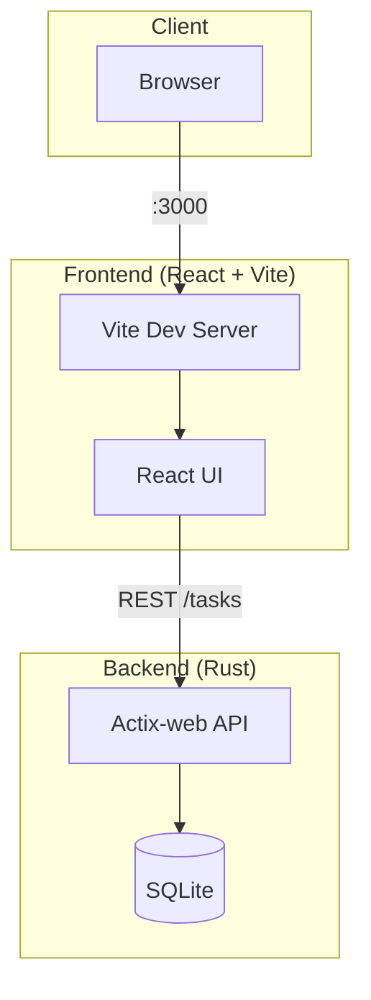

# Task Manager

A full-stack task management application with Rust backend and React frontend.

## Features

- Task creation with title, description, tags, deadlines
- Project-based task organization
- Organization-wide task views
- AI-powered task generation from meeting notes (xAI Grok / Google Gemini)
- Google Account integration
- Micro-management avoidance through smart automation

## Architecture



## Prerequisites

### Backend

- **Rust** (1.70+)
  ```bash
  curl --proto '=https' --tlsv1.2 -sSf https://sh.rustup.rs | sh
  source $HOME/.cargo/env
  ```

### Frontend

- **Node.js** (20.19+)
  ```bash
  # nvm (recommended)
  curl -o- https://raw.githubusercontent.com/nvm-sh/nvm/v0.40.1/install.sh | bash
  source ~/.bashrc
  nvm install 20
  nvm use 20
  ```

## Setup

### Backend (Rust)

1. Navigate to the backend directory:
   ```
   cd backend
   ```

2. Install dependencies:
   ```
   cargo build
   ```

3. Run the server:
   ```
   cargo run
   ```

### Frontend (React)

1. Navigate to the frontend directory:
   ```
   cd frontend
   ```

2. Install dependencies:
   ```
   npm install
   ```

3. Start the development server:
   ```
   npm run dev
   ```

   **For network sharing** (e.g. company LAN): Add `--host` so others can access from their browsers. Set `VITE_API_URL` to your machine's IP so API calls work from their machines:
   ```
   VITE_API_URL=http://YOUR_IP:8080 npm run dev -- --host
   ```
   Replace `YOUR_IP` with your machine's IP (e.g. `172.19.47.88`). Others can then open `http://YOUR_IP:3000`.

## Usage

- **Backend**: http://localhost:8080 (or http://YOUR_IP:8080 when sharing on network)
- **Frontend**: http://localhost:3000 (or http://YOUR_IP:3000 when using `--host`)

### Environment Variables

- `VITE_API_URL`: API base URL for the frontend (default: `http://127.0.0.1:8080`). When sharing on a network, set to `http://YOUR_IP:8080` so clients can reach the API. Set in `frontend/.env` or pass when running `npm run dev`.
- `DATABASE_URL`: SQLite database URL (default: `sqlite:./data/tasks.db`). The `backend/data/` directory is created automatically.
- `AI_PROVIDER`: AI provider for task generation. Set to `gemini` (default) or `xai`. Use `gemini` when xAI is unavailable (e.g. corporate networks).
- `GEMINI_API_KEY`: Google Gemini API key. Required when `AI_PROVIDER=gemini`. Create a key at [Google AI Studio](https://aistudio.google.com/apikey).
- `GEMINI_MODEL`: Optional. Gemini model name (default: `gemini-2.5-flash`).
- `XAI_API_KEY`: xAI API key. Required when `AI_PROVIDER=xai`. Create a key at [xAI Console](https://console.x.ai/team/default/api-keys).

  Example (Gemini, recommended for corporate environments):
  ```bash
  export AI_PROVIDER=gemini
  export GEMINI_API_KEY="your_gemini_api_key_here"
  cargo run
  ```

  Example (xAI):
  ```bash
  export AI_PROVIDER=xai
  export XAI_API_KEY="your_api_key_here"
  cargo run
  ```

### Managing Projects and Assignees

Projects and assignees are managed via the API. Users can only select from the predefined list when creating or editing tasks. Use `curl` or similar to add new entries.

Replace `http://localhost:8080` with `http://YOUR_IP:8080` when accessing from another machine.

**Add a new project:**
```bash
curl -X POST http://localhost:8080/projects \
  -H "Content-Type: application/json" \
  -d '{"name": "Backend"}'
```

**List projects:**
```bash
curl http://localhost:8080/projects
```

**Delete a project** (cannot delete "General", id=1):
```bash
curl -X DELETE http://localhost:8080/projects/2
```

**Add a new assignee:**
```bash
curl -X POST http://localhost:8080/assignees \
  -H "Content-Type: application/json" \
  -d '{"name": "Alice"}'
```

**List assignees:**
```bash
curl http://localhost:8080/assignees
```

**Delete an assignee** (cannot delete "Unassigned", id=1):
```bash
curl -X DELETE http://localhost:8080/assignees/2
```

Tags remain free-form; users can add any tag when creating or editing tasks.
