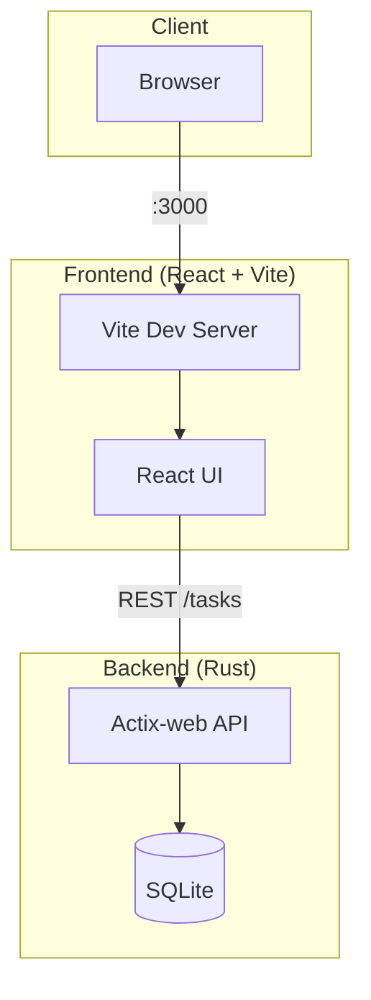

# Task Manager

A full-stack task management application with Rust backend and React frontend.

## Features

- Task creation with title, description, tags, deadlines
- Project-based task organization
- Organization-wide task views
- AI-powered task generation from meeting notes (xAI Grok)
- Google Account integration
- Micro-management avoidance through smart automation

## Architecture



## Prerequisites

### Backend

- **Rust** (1.70+)
  ```bash
  curl --proto '=https' --tlsv1.2 -sSf https://sh.rustup.rs | sh
  source $HOME/.cargo/env
  ```

### Frontend

- **Node.js** (20.19+)
  ```bash
  # nvm (recommended)
  curl -o- https://raw.githubusercontent.com/nvm-sh/nvm/v0.40.1/install.sh | bash
  source ~/.bashrc
  nvm install 20
  nvm use 20
  ```

## Setup

### Backend (Rust)

1. Navigate to the backend directory:
   ```
   cd backend
   ```

2. Install dependencies:
   ```
   cargo build
   ```

3. Run the server:
   ```
   cargo run
   ```

### Frontend (React)

1. Navigate to the frontend directory:
   ```
   cd frontend
   ```

2. Install dependencies:
   ```
   npm install
   ```

3. Start the development server:
   ```
   npm run dev
   ```

## Usage

- Backend runs on http://127.0.0.1:8080 (or http://localhost:8080)
- Frontend runs on http://localhost:3000

### Environment Variables

- `VITE_API_URL`: API base URL for the frontend (default: `http://127.0.0.1:8080`). Set in `frontend/.env` for custom backends.
- `DATABASE_URL`: SQLite database URL (default: `sqlite:./data/tasks.db`). The `backend/data/` directory is created automatically.
- `XAI_API_KEY`: xAI API key for AI task generation. Required for the "Generate Tasks from Meeting Notes (AI)" feature. Create a key at [xAI Console](https://console.x.ai/team/default/api-keys) and set it when running the backend:
  ```bash
  export XAI_API_KEY="your_api_key_here"
  cargo run
  ```
